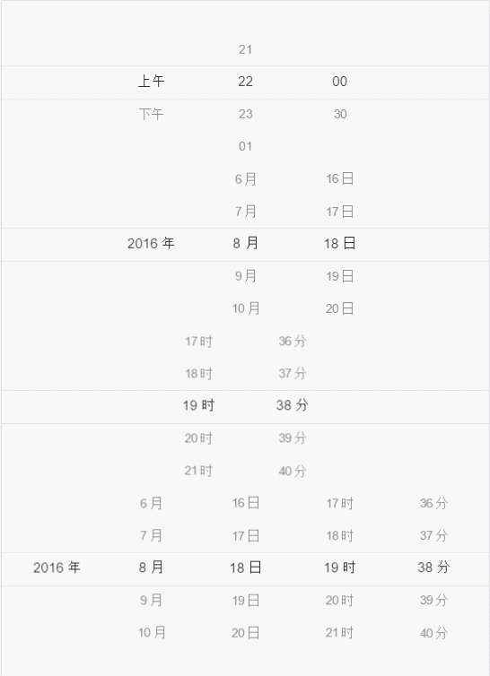
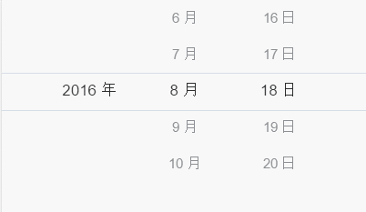
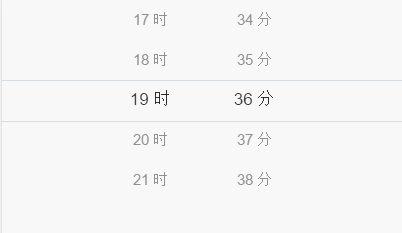
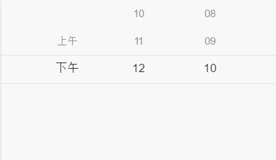
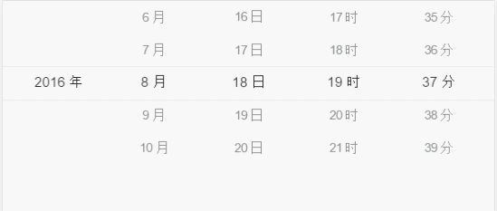

# 日期时间选择器-中文文档

基于javascript的日期时间滑动选择器;
支持**date**,**time**,**datetime**,**diy**模式.

博客教程:

[手把手教你写Js日期时间选择器(1)-基本结构](http://blog.csdn.net/u012963788/article/details/52160333)

[手把手教你写Js日期时间选择器(2)-样式实现](http://blog.csdn.net/u012963788/article/details/52160618)

[手把手教你写Js日期时间选择器(3)-让控件滑动起来](http://blog.csdn.net/u012963788/article/details/52197584)

---
在线演示地址:

[在线演示](http://runjs.cn/detail/m0zy1iip)

[在线演示全屏](http://sandbox.runjs.cn/show/m0zy1iip)

[在线调试](http://runjs.cn/code/m0zy1iip)

##预览.

###全部效果


###日期效果
---


###时间效果
---


###自定义效果
---


###日期加时间
---


##示例

###基本使用
1. 添加样式文件到页面<code>&lt;link rel="stylesheet" href="../dest/datetime.min.css"&gt;</code>
2. 添加脚本文件到页面<code>&lt;script src="../dest/datetime.min.js"&gt;&lt;/script&gt;</code>
3. 在页面添加<code>&lt;div class="ui-datetime" id="datetime"&gt;&lt;/div&gt;</code>
4. 添加如下代码.

```javascript
	var datetime = new DateTime(document.getElementById("datetime"), null);
    datetime.init();
    datetime.bindEvent();
```

---

###jQuery插件使用
1. 添加jQuery依赖.
2. 添加样式文件到页面<code>&lt;link rel="stylesheet" href="../dest/datetime.min.css"&gt;</code>
3. 添加脚本文件到页面<code>&lt;script src="../dest/JQuery.datetime.min.js"&gt;&lt;/script&gt;</code>
4. 在页面添加<code>&lt;div class="ui-datetime" id="datetime"&gt;&lt;/div&gt;</code>
5. 添加如下代码.


```javascript
 $("#datetime2").datetime({
    type: 'date',
    date: new Date(),
    minDate: new Date(),
    maxDate: new Date(),
    onChange: function (data) {
        console.log("call back", data);
    }
});
```


##<span id="options">配置选项</span>

###默认配置

```javascript
{
    type: 'date',
    date: new Date(),
    minDate: new Date(),
    maxDate: new Date(),
    data: [{
        key: 'day',
        resource: ["上午", "下午"],
        value: "上午",
        unit: ''
    }, {
        key: 'hour',
        resource: ["21", "22", "23", "01", "02", "03", "04", "05", "06", "07"],
        value: "22",
        unit: ''
    }, {
        key: 'minute',
        resource: ["00", "30"],
        value: "00",
        unit: ''
    }],
    onChange: function (data) {
        console.log("call back", data);
    }
};
```


###type

String. 默认值:date.

DateTimePicker显示的类型.

接受的值:

* date
* time
* datetime
* diy


###date

Date.默认值:当前日期.

当前选中的值.

###minDate

Date.默认值:当前日期.

开始时间.

###maxDate

Date.默认值:当前日期.

结束时间.


###data

Object.

```javascript
{
    key: 'day',
    resource: ["上午", "下午"],
    value: "上午",
    unit: ''
}
```

* key.
* resource.显示的项
* value. 选中的值
* unit. 单位


###onChange

Function.

回调函数.
当<code>DateTimePicker</code>的选择的值改变时回调此函数.

```javascript
onChange: function (data) {
    console.log("call back", data);
}
```


##方法

###1. constructor

<code>DateTime(ele,options)</code>

* ele:DOM节点
* options: [配置信息](#options)

```javascript
var datetime = new DateTime(ele,options);
```


###2. init

初始化<code>DateTimePicker</code>.

```javascript
var datetime = new DateTime(...);
datetime.init();
```

###3. bindEvent

为<code>DateTimePicker</code>绑定滑动事件.
通常不需要调用此方法;因为在<code>DateTimePicker</code>内部已经调用


```javascript
var datetime = new DateTime(...);
datetime.bindEvent();
```

###4. hide

隐藏 <code>DateTimePicker</code>


```javascript
var datetime = new DateTime(...);
datetime.hide();
```

###5. show
显示 <code>DateTimePicker</code>

```javascript
var datetime = new DateTime(...);
datetime.show();
```
