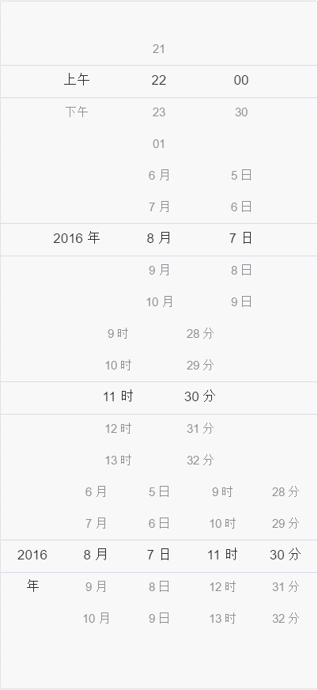

# DateTiemPicker

Based on Javascript date picker.

博客教程:

[手把手教你写Js日期时间选择器(1)-基本结构](http://blog.csdn.net/u012963788/article/details/52160333)

[手把手教你写Js日期时间选择器(2)-样式实现](http://blog.csdn.net/u012963788/article/details/52160618)

[手把手教你写Js日期时间选择器(3)-让控件滑动起来](http://blog.csdn.net/u012963788/article/details/52197584)

##Image preview.

##Usage

include datatime.css file.

	
	

 	var datetime = new DateTime(document.getElementById("J_popup_offdelay"), null);

    datetime._init();
    datetime.bindEvent();

###With jQuery/Zepto

	
	
	
	
	$("#J_popup_offdelay").datetime();

### options

	{
        type: 'diy',//date,time,diy
        date: new Date(),
        minDate: new Date(),
        maxDate: new Date(),
        data: [{
            key: 'day',
            resource: ["上午", "下午"],
            value: "上午",
            unit: ''
        }, {
            key: 'hour',
            resource: ["21", "22", "23", "01", "02", "03", "04", "05", "06", "07"],
            value: "22",
            unit: ''
        }, {
            key: 'minute',
            resource: ["00", "30"],
            value: "00",
            unit: ''
        }],
        onChange: function (data) {
            console.log("call back", data);
        }
    }
